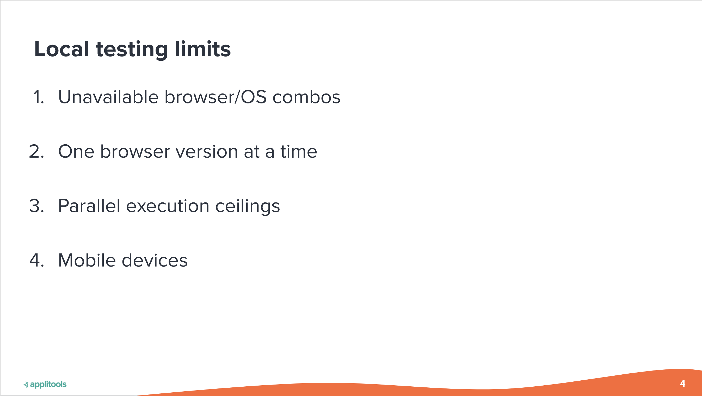
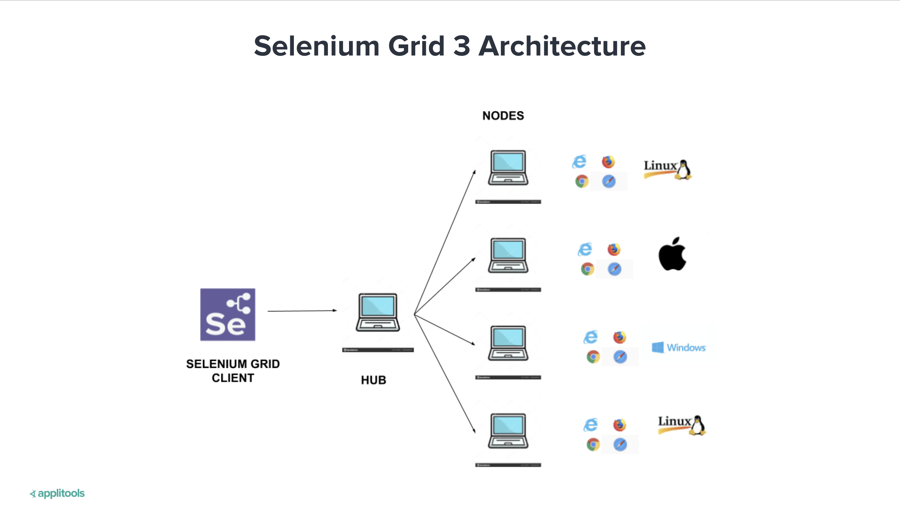
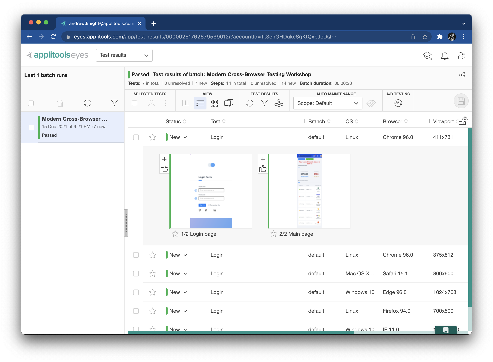
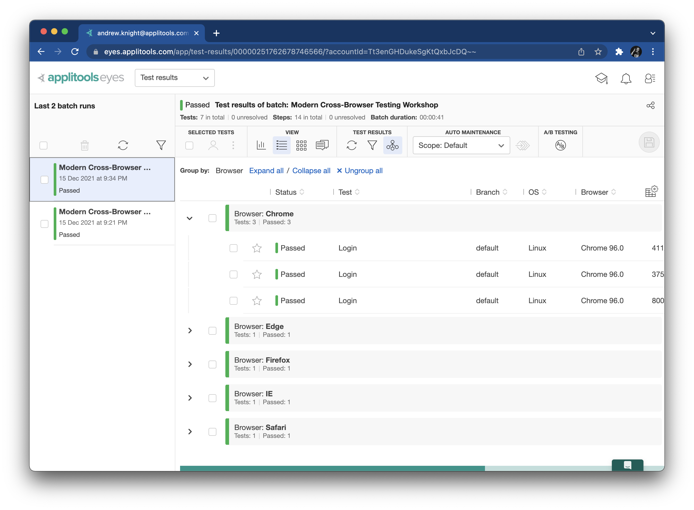
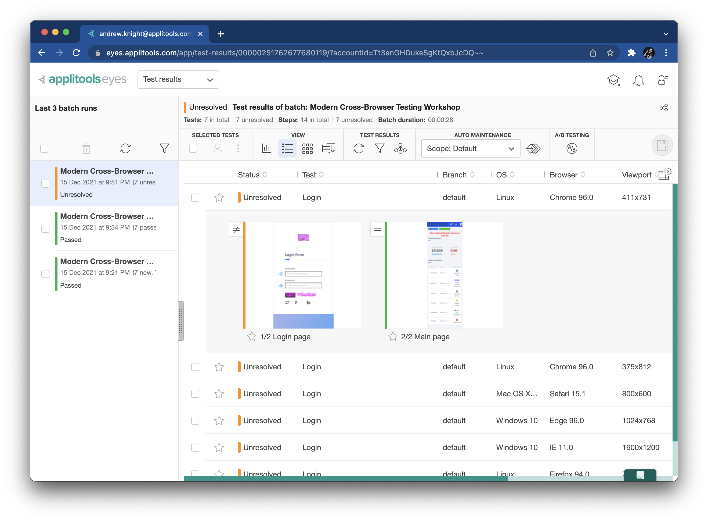

# Workshop Walkthrough

This guide provides a full written walkthrough for the
[Modern Cross-Browser Testing](https://applitools.com/crossbrowser-testing-workshop/) workshop
led by [Pandy Knight](https://twitter.com/AutomationPanda)
and hosted by [Applitools](https://applitools.com/).
You can code along with the video recordings,
or you can reference it afterwards to help you learn more.


## 1. Traditional cross-browser testing

Traditional cross-browser testing requires lots of work,
both in automating test cases and in maintaining testing infrastructure.
Let's give this a try ourselves to see what it takes.


### 1.1 Writing a typical login test

Web UI testing is all about app behaviors:
interacting with visual interfaces and verifying outcomes.
Let's automate a simple website login test to use for cross-browser testing.
We will use the [Applitools demo site](https://demo.applitools.com):
`https://demo.applitools.com`.

The test steps are straightforward:

```gherkin
Scenario: Successful login
  Given the login page is displayed
  When the user enters their username and password
  And the user clicks the login button
  Then the main page is displayed
```

The login page looks like this:


And the main page looks like this:


We can automate this test in many ways,
but for this workshop,
we will build a Java [Maven](https://search.maven.org/) project
with [JUnit 5](https://junit.org/junit5/)
and [Selenium WebDriver](https://www.selenium.dev/documentation/webdriver/).
In this repository,
[`src/test/java/com/applitools/TraditionalTest.java`](src/test/java/com/applitools/TraditionalTest.java)
is an automated implementation of this login test.
As typical for WebDriver-based tests,
this test class has `WebDriver` and `WebDriverWait` instance variables
that are initialized before each test and cleaned up after each test:

```java
public class TraditionalTest
{
    private WebDriver driver;
    private WebDriverWait wait;

    @BeforeEach
    public void startWebDriver()
    {
        driver = new ChromeDriver();
        wait = new WebDriverWait(driver, 15);
    }

    @AfterEach
    public void quitWebDriver()
    {
        driver.quit();
    }
    
    // ...
}
```

The login test itself is broken down into parts with helper methods:

```java
    @Test
    public void login()
    {
        loadLoginPage();
        verifyLoginPage();
        performLogin();
        verifyMainPage();
    }
```

Loading the login page looks like this:

```java
    private void loadLoginPage()
    {
        driver.get("https://demo.applitools.com");
    }
```

Once the login page is loaded, the test verifies that certain things appear:

```java
    private void waitForAppearance(By locator)
    {
        wait.until(d -> d.findElements(locator).size() > 0);
    }

    private void verifyLoginPage()
    {
        waitForAppearance(By.cssSelector("div.logo-w"));
        waitForAppearance(By.id("username"));
        waitForAppearance(By.id("password"));
        waitForAppearance(By.id("log-in"));
        waitForAppearance(By.cssSelector("input.form-check-input"));
    }
```

These assertions explicitly wait for a specific set of elements to appear.
They check purely for appearance – not for any shape, size, or look.

Performing login requires a few WebDriver interactions:

```java
    private void performLogin()
    {
        driver.findElement(By.id("username")).sendKeys("andy");
        driver.findElement(By.id("password")).sendKeys("i<3pandas");
        driver.findElement(By.id("log-in")).click();
    }
```

Once login is complete, the main page appears.
Unfortunately, there's almost too much on the main page to check!
The test picks a few important things and makes several assertions:

```java
    private void verifyMainPage()
    {
        // Check various page elements
        waitForAppearance(By.cssSelector("div.logo-w"));
        waitForAppearance(By.cssSelector("div.element-search.autosuggest-search-activator > input"));
        waitForAppearance(By.cssSelector("div.avatar-w img"));
        waitForAppearance(By.cssSelector("ul.main-menu"));
        waitForAppearance(By.xpath("//a/span[.='Add Account']"));
        waitForAppearance(By.xpath("//a/span[.='Make Payment']"));
        waitForAppearance(By.xpath("//a/span[.='View Statement']"));
        waitForAppearance(By.xpath("//a/span[.='Request Increase']"));
        waitForAppearance(By.xpath("//a/span[.='Pay Now']"));

        // Check time message
        assertTrue(Pattern.matches(
                "Your nearest branch closes in:( \\d+[hms])+",
                driver.findElement(By.id("time")).getText()));

        // Check menu element names
        var menuElements = driver.findElements(By.cssSelector("ul.main-menu li span"));
        var menuItems = menuElements.stream().map(i -> i.getText().toLowerCase()).toList();
        var expected = Arrays.asList("card types", "credit cards", "debit cards", "lending", "loans", "mortgages");
        assertEquals(expected, menuItems);

        // Check transaction statuses
        var statusElements = driver.findElements(By.xpath("//td[./span[contains(@class, 'status-pill')]]/span[2]"));
        var statusNames = statusElements.stream().map(n -> n.getText().toLowerCase()).toList();
        var acceptableNames = Arrays.asList("complete", "pending", "declined");
        assertTrue(acceptableNames.containsAll(statusNames));
    }
```

Wow, that's a little overwhelming.
Some assertions just check that elements appear.
Others check aspects of elements, like text values.
Nevertheless, the element locators and the code for performing these assertions are a bit complex.
They also do *not* cover everything on the page.
There's risk that unchecked things could break.


### 1.2 Running the test locally

Let's run this test locally.
The easiest way to run the tests is one at a time through an IDE.
Alternatively, you can run the tests from the command line with Maven using the `mvn test` command.
Just make sure that you have an up-to-date version of [Google Chrome](https://www.google.com/chrome/)
installed on your machine with matching version of [ChromeDriver](https://chromedriver.chromium.org/)
installed on your system path.
The test should take a few minutes total, and it should pass.

Unfortunately, this test overlooks visual things.
For example, consider what would happen if the login page looked like this instead:


Can you spot the subtle differences?

* The icon at the top is broken
* The "Sign in" button now says "Log in"
* This button changed from blue to black

Traditional test automation struggles to detect differences like these.
We could try to add more assertions to our test,
but they'd probably be complicated and fragile.
For now, let's take a risk and ignore them.
(We will revisit ways to handle them better later in this workshop.)

If we want to run this test against either version of the login page,
we could update the `loadLoginPage` method like this:

```java
    private void loadLoginPage()
    {
        String site = System.getenv().getOrDefault("DEMO_SITE", "original");

        if (site.equals("original"))
            driver.get("https://demo.applitools.com");
        else
            driver.get("https://demo.applitools.com/index_v2.html");
    }
```

Then, we could set the `DEMO_SITE` environment variable to `original` or `changed`
to control which page the test will target.
Try running with `DEMO_SITE=changed` – the test will still pass!


### 1.3 Updating the test to handle multiple browsers

Right now, `TraditionalTest` targets only one browser: Chrome.
That's not good practice.
We should be able to run this test against *any* browser.

One way to test multiple browsers is to parameterize tests to run against a set of configurations.
Unfortunately, this is typically not good practice for traditional tests.
Most test frameworks parameterize at the level of the test case,
so testers would need to duplicate browser specs for each test.
Plus, as browser needs change in the future,
testers would need to change lots of this parameterization code.

A better practice for traditional tests is for every test suite launch to target *one* browser configuration,
and for testers to select the target browser as an input to automation.
For example, we can update the `startWebDriver` method to dynamically pick a browser like this:

```java
    @BeforeEach
    public void startWebDriver()
    {
        String browserName = System.getenv().getOrDefault("BROWSER", "chrome");

        driver = browserName.equalsIgnoreCase("firefox")
            ? new FirefoxDriver()
            : new ChromeDriver();

        wait = new WebDriverWait(driver, 15);
    }
```

This method now reads an environment variable named `BROWSER`.
If `BROWSER=firefox`, then the test will target Firefox.
Otherwise, it will target Chrome.
We could add other browser types and even other input configurations like this.

Try running it once with Firefox.
It should work just fine, and the test should pass.


### 1.4 Scaling out cross-browser testing yourself

Local testing is fine while developing automated tests,
but it's not good practice for running tests "for real."
Local machines have limits:



* Not all browsers are supported on all operating systems.
  For example, Safari does not run on Windows, and IE 11 does not run on macOS.
* One machine can have only one version of a browser at a time,
  unless you make some questionable hacks.
* One machine can run only a limited number of tests in parallel.
  Optimal execution time is typically 1 web test per processor/core.
* Laptops are not mobile devices.
  Either you emulate mobile devices or connect remotely to physical devices.

Ideally, web UI tests should be run from a Continuous Integration system
with scaled-out infrastructure to handle cross-browser testing.

One way to do this is to build the infrastructure yourself.
If your tests use Selenium WebDriver, then you can build a
[Selenium Grid](https://www.selenium.dev/documentation/grid/) instance.
Selenium Grid is an open-source tool for creating a cluster of nodes
that can run WebDriver browser sessions.
Each node can have its own operating system, browsers, and versions installed.
The grid receives requests for browser sessions and connects the requester to a node.



I did this when I worked at [Q2](https://www.q2.com/).
You can read all about it in a case study I wrote in collaboration with [Tricentis](https://www.tricentis.com/):
[How Q2 uses BDD with SpecFlow for testing PrecisionLender](https://automationpanda.com/2021/09/21/how-q2-uses-bdd-with-specflow-for-testing-precisionlender/).
Basically, we created multiple Selenium Grid instances using Windows virtual machines in Microsoft Azure.
When tests launched, TeamCity (our CI system) ran PowerShell scripts to power on the VMs.
The grid would take a few minutes to boot.
Then, once tests completed, TeamCity ran PowerShell scripts to power off the VMs to save money.
Since we tightly controlled the grids, tests ran just as fast as they did on our local laptops.
We could scale up to 100 parallel tests.

However, even though Selenium Grid is open source, DIY grids are not "free".
Figuring out correct setup, security policies, and performance tuning took our team *months*.
It truly was never a finished project because we kept needing to make adjustments as our suites grew.
We also had to set up and configure everything manually.
Any time a browser update came along, we needed to log into every VM and make updates.

On top of perpetual maintenance, our grids would arbitrarily crash from time to time.
Hubs would go unresponsive.
Browser sessions on nodes would freeze.
Debugging these issues was practically impossible, too.
Usually, all we could do was just relaunch test suites.

My team and I could manage our own Selenium Grid instances because we kept our configuration streamlined.
We only ever tested Chrome.
We were more interested in speed than cross-browser coverage.
Nevertheless, 75% of our customers used IE 11,
and we took a steep risk by avoiding IE testing just to keep our infrastructure manageable.


True cross-browser testing has a combinatorial explosion of screens to cover.
Think about every browser, OS, platform, and version.
Then, think about every page, viewport, and even language.
That's enormous!
Building your own grid, you can accommodate some of these, but not all.


I liken managing your own Selenium Grid to maintaining a classic car.
Personally, I'm the proud owner of a vintage 1970 Volkswagen Beetle.
Even though classic cars are cool, they take *lots* of effort to keep running.
I need to regularly change the oil, adjust the valves, tune the carburetor,
seal rusty spots, replace fuel filters, and watch for engine leaks.
Sadly, one time, I was not careful, and my engine overheated, which completely ruined it.
I had to spend thousands of dollars on a whole new engine build.
Modern cars don't require this much hands-on care.
Classic cars, like DIY grids, need time, expertise, and effort.


### 1.5 Scaling out cross-browser testing as a service

Instead of building your own infrastructure,
you can pay a vendor to provide it for you.
A vendor handles all the screen combinations for you.
Your test simply needs to declare what you want for your remote WebDriver session.
Vendor platforms also typically have nice features like dashboards, screenshots, and videos.


Unfortunately, traditional cross-browser-testing-as-a-service still has problems.
Difficulties with security, debuggability, and reliability are the same as for DIY grids.
Tests also run much slower because they need to communicate with a more distant session.
Anecdotally, my tests have taken 2-4x more time to complete versus running locally or in my own grid.
That's *huge*.
Furthermore, cross-browser vendor services can be quite expensive,
and they set ceilings on your level of scale with your service plans.


## 2. Modern cross-browser testing

There's got to be a better way to do cross-browser testing!
Let's rethink our approach in what we want to test
and how techniques like visual testing can simplify things.


### 2.1 Reconsidering what should be tested

What is the purpose of testing apps across multiple browsers?
Historically, browsers were radically different.
The JavaScript on one page would literally function differently in different browsers.
These days, however, browsers have largely standardized on JavaScript.
Traditional functional testing in one browser is typically good enough to verify that.
Cross-browser testing should focus on the visuals of rendering and responsiveness.

Here are some examples of visual blunders that traditional automated testing would miss:


### 2.2 Introducing Applitools Ultrafast Grid

This is where Applitools can help
with a modern solution for cross-browser testing:
[Visual AI](https://applitools.com/applitools-ai-and-deep-learning/)
with the [Ultrafast Grid](https://applitools.com/product-ultrafast-test-cloud/).


Visual testing is all about capturing snapshots of pages and inspecting them for differences.
Notice how I used the word "snapshot," not "screenshot."
Screenshots are just static pixel images.
A *snapshot* is an instantaneous capture of the whole UI for a page: HTML, CSS, JavaScript, the works!
Snapshots can be re-rendered in different browsers and screen size to test their responsiveness.

Here's how we can rework our old login test into a visual test.
First, we can add the [Applitools Eyes](https://applitools.com/products-eyes/) SDK
to take visual snapshots of the login and main pages.
We still need the Selenium WebDriver automation for interactions,
but we can replace many (if not all) of the old assertions with visual checkpoints.
Next, we can configure a runner to render those snapshots
using multiple browsers and devices in Applitools Ultrafast Grid.
The test will run once locally,
but all cross-browser testing will be done in the Applitools Cloud with parallel execution.

Since the only testing done in Ultrafast Grid is visual rendering and comparison, it's very fast.
The infrastructure is also simpler because communication is a single direction
from the test machine to the Applitools cloud.
There's no back-and-forth communication like with a traditional functional test.

You can use Applitools Eyes and the Ultrafast Grid with any automation tool or framework:
Selenium, Appium, Playwright, Cypress, WebDriverIO, Nightwatch, and more.

If you want specific data on how much faster and more efficient your testing can be
with Visual AI and Applitools Ultrafast Grid,
then check out this report:
[Modern Cross Browser Testing Through Visual AI Report: 3,112 hours of empirical data sourced from 203 engineers](https://applitools.com/modern-cross-browser-testing-report/).


### 2.3 Rewriting login as a visual test

Let's rewrite our login test into a visual test.
The test steps can remain the same, but the setup and assertions will change.
In this repository,
[`src/test/java/com/applitools/UltrafastVisualTest.java`](src/test/java/com/applitools/UltrafastVisualTest.java)
contains the updated code.

First, our test needs some new instance variables:

```java

public class UltrafastVisualTest
{
    private WebDriver driver;
    private VisualGridRunner runner;
    private Eyes eyes;

    // ...
}
```

We still need a `WebDriver` instance, but we won't need `WebDriverWait`.
We will also need a `VisualGridRunner` for running tests in Ultrafast Grid
and `Eyes` for capturing snapshots.

Second, we need to rewrite our setup.
Our original test constructed a WebDriver instance based on an input for browser name.
For the visual test, we can just pick one browser to run locally (such as Chrome)
and also initialize the Applitools stuff.
Let's also make it possible to run headless Chrome:

```java
    @BeforeEach
    public void setUpVisualAI()
    {
        // Determine if Chrome should be headless
        boolean headless = System.getenv().getOrDefault("HEADLESS", "false")
            .equalsIgnoreCase("true");

        // Prepare Eyes and Ultrafast Grid for Selenium WebDriver
        driver = new ChromeDriver();
        runner = new VisualGridRunner(new RunnerOptions().testConcurrency(5));
        eyes = new Eyes(runner);
        
        // ...
    }
```

Third, we need to configure the browsers and devices we want to run in Ultrafast Grid.
We can set this up one time in the `@BeforeEach` method so that all tests will run the same targets:

```java
    @BeforeEach
    public void setUpVisualAI()
    {
        // ...
        
        // Initialize Eyes Configuration
        Configuration config = eyes.getConfiguration();

        // You can get your API key from the Applitools dashboard
        config.setApiKey(System.getenv("APPLITOOLS_API_KEY"));

        // Create a new batch
        config.setBatch(new BatchInfo("Modern Cross-Browser Testing Workshop"));

        // Add browsers with different viewports
        config.addBrowser(800, 600, BrowserType.CHROME);
        config.addBrowser(700, 500, BrowserType.FIREFOX);
        config.addBrowser(1600, 1200, BrowserType.IE_11);
        config.addBrowser(1024, 768, BrowserType.EDGE_CHROMIUM);
        config.addBrowser(800, 600, BrowserType.SAFARI);

        // Add mobile emulation devices in Portrait mode
        config.addDeviceEmulation(DeviceName.iPhone_X, ScreenOrientation.PORTRAIT);
        config.addDeviceEmulation(DeviceName.Pixel_2, ScreenOrientation.PORTRAIT);

        // Set the configuration object to Eyes
        eyes.setConfiguration(config);
    }
```

You will need to set your Applitools API key,
which you can retrieve from your Applitools account and pass through as an environment variable.
Then, you can name the batch and specify all the browser and device targets.
Here, we will test against five desktop browsers and two mobile browsers.
Notice that you can also set viewport sizes and orientations.
You can test all the major browsers up to two previous versions,
and you can test over 60 emulated mobile devices.
The configuration is concise and declarative.

Test cleanup must be enhanced, too.
In addition to quitting the browser,
we should print the test summary to the console.
This is not required, but it is helpful for logging:

```java
    @AfterEach
    public void cleanUpTest()
    {
        // Quit the WebDriver instance
        driver.quit();

        // Report visual differences
        TestResultsSummary allTestResults = runner.getAllTestResults(true);
        System.out.println(allTestResults);
    }
```

The `login` test method must be updated to capture visual snapshots, too:

```java
    @Test
    public void login()
    {
        try
        {
            // Open Eyes to start visual testing
            eyes.open(
                    driver,
                    "Applitools Demo App",
                    "Login",
                    new RectangleSize(800, 600));

            // Run the test steps, but with visual checks
            loadLoginPage();
            verifyLoginPage();
            performLogin();
            verifyMainPage();

            // Close Eyes to tell the server it should display the results
            eyes.closeAsync();
        }
        finally
        {
            // Notify the server if the test aborts
            eyes.abortAsync();
        }
    }
```

The four methods for test steps remain the same,
but they are now surrounded by calls to `eyes.open(...)` and `eyes.closeAsync()`.
The whole block is surrounded by try/catch so that Applitools Eyes can handle any test aborts smoothly.

The `loadLoginPage` and `performLogin` methods do not need any changes because the interactions are the same.
However, the "verify" methods can reduce drastically:

```java
    private void verifyLoginPage()
    {
        eyes.check(Target.window().fully().withName("Login page"));
    }

    private void verifyMainPage()
    {
        // This snapshot uses LAYOUT match level to avoid differences in
        // "Your nearest branch closes in: ..." times
        eyes.check(Target.window().fully().withName("Main page").layout());
    }
```

**"A picture is worth a thousand assertions."**
Previously, these methods had multiple complicated assertions
that merely checked if some elements appeared or had certain text values.
Now, Applitools Eyes captures a full snapshot,
checking *everything* on the page like a pair of human eyes.
It's one, simple, declarative capture.
We just say "check it" instead of spending time splicing selectors and making explicit comparisons.
It also covers aspects like broken images and colors that our traditional functional test missed.

As a software engineer myself,
I cannot understate how much development time these visual checkpoints save me.
I spend so much time trying to find locators and program clever assertions,
but they are so fragile,
and there are only so many assertions I can include.


### 2.4 Running visual tests across multiple browsers

Let's run `UltrafastVisualTest` with the original login page to set baselines.
Make sure to set the `APPLITOOLS_API_KEY` environment variable to your API key.
When launched locally, you should see one Chrome session open and close within a few seconds.
Then, the automation uploads the snapshots to Applitools Ultrafast Grid to run against the seven other targets.
All tests should take about half a minute to complete.

Results in the Applitools Eyes dashboard should look like this:



Notice how the batch of tests has one test for each target configuration.
Each test has two snapshots: one for the login page, and one for the main page.
All tests have "New" status because they are baselines.

Run the tests again.
The second run should succeed just like the first.
However, the new dashboard results now say "Passed"
because Applitools compared the latest snapshots to the baselines
and verified that they had not changed.
You can also group results by browser, OS, and other criteria:



To show the power of Visual AI in testing,
let's run the tests one more time with visual changes to the demo site.
Set the environment variable `DEMO_SITE=changed`, and rerun.
This time, changes are detected on the login page!
Changes are *not* detected on the main page despite different numbers on the page
because we set the match level to LAYOUT.



We can address these results just like any other visual results.

As you can see, the big advantages of this type of cross-browser testing are:

1. *Speed:* tests take second instead of minutes
2. *Simplicity:* visual checkpoints replace complicated assertions
3. *Sharpness:* Visual AI accurately highlights meaningful changes to a human eye


### 2.5 Integrating modern cross-browser testing with CI/CD

Just like any other automated test suite,
visual tests with Applitools Eyes and Ultrafast Grid can (and should)
run from a Continuous Integration and Delivery (CI/CD) system.
For example, you can integrate Applitools Eyes with Jenkins using the
[Jenkins plugin](https://plugins.jenkins.io/applitools-eyes/),
or you could simply launch tests from an agent's command line as part of a build job.

CI/CD systems can trigger tests automatically:

* *continuously* after code changes
* *periodically* on schedules (like every night)
* *on demand* whenever users manually launch tests

This repository is configured with GitHub Actions to run `UltrafastVisualTest`:

* [Run UltrafastVisualTest (Original)](https://github.com/AutomationPanda/applitools-cbt-20211216/actions/workflows/RunUltrafastVisualTest.yml)
  runs the test with the original pages.
* [Run UltrafastVisualTest (Changed)](https://github.com/AutomationPanda/applitools-cbt-20211216/actions/workflows/RunUltrafastVisualTestChanged.yml)
  runs the test with the changed pages to reveal visual failures.

Ideally, teams want to get as many results as they can as quickly as possible.
Fast feedback means that teams can resolve issues before they become more costly to fix.
Unfortunately, traditional UI tests tend to be slow, especially with cross-browser variations.
Teams face a tradeoff between coverage and fast feedback:
more coverage means lower risk but slower feedback.
Modern cross-browser testing with Visual AI and Applitools Ultrafast Grid enables more testing in less time,
which widens coverage, preserves fast feedback, and enables UI testing to become continuous.
It shifts testing further left.
